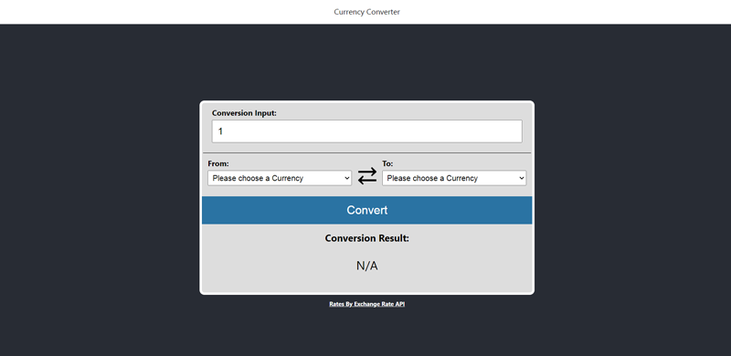

# README
This is an app that converts currency using the [Currency Exchange API](https://www.exchangerate-api.com/).

## Requirement
You will need [Docker](https://www.docker.com/) to run this app.

## Running the App
You will need to first setup the environmental variable by running the following:
### Development
```
cp ./docker/dev.env .env
```
### Production
```
cp ./docker/prod.env .env
```
### Seeing the App
You need to run `docker-compose up` to get the app running. Then, you can access the server side via the following url:
```
http://localhost:3000
```
Similarly, you can see the client-side app via the following url:
```
http://localhost:8080
```
The below is what you should see in your browser:


### Switching between Modes
You need to change the `.env` using the commands mentioned in the previous sections. Then, you need to run the following:
```
docker-compose down -v
docker-compose build
docker-compose up
```

## Miscellaneous
I left the code for how I got the codes for the currency in the `currency-codes` folder. In short, scraped the table on the [currency codes page](https://www.exchangerate-api.com/docs/supported-currencies) of the Currency Exchange API site and turned it into a JSON file. You will need `nodejs` to run this script.
